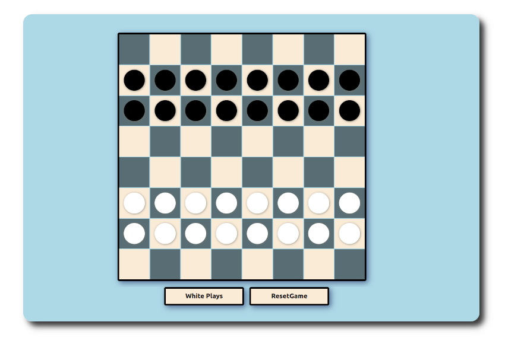

# Türk Daması 

[Oyunu oynamak için tıklayınız.](https://turkish-checkers.netlify.app/ "Türk Daması")

Dama sevilen bir zeka oyunu. 64 karede 32 taş ile oynanır. Türk Damasında taşlar sadece öne ve yana gider, çapraz hareket etmez. Damaya çıkan taş geri hareket de yapabilir. Damada amaç karşı rakibin tüm taşlarını yemektir. 

## Kullanılan Teknolojilar

Dama oyununu geliştirirken kullandığımız teknolojiler şunlardır.

- JavaScript
- React JS.
- Redux
- HTML
- CSS

## Oyunun Ekran Görüntüsü

## Uygulama Geliştirilme Aşamasındadır

Uygulama geliştirme aşamasındadır. Bu nedenle tüm fonksiyonları çalışmayabilir. Eğer uygulama üzerinde eklemek istediğiniz bir şeyler varsa 
bize ulaşabilirsiniz.

## [Oyunu oynamak için tıklayınız.](https://turkish-checkers.netlify.app/ "Türk Daması")

